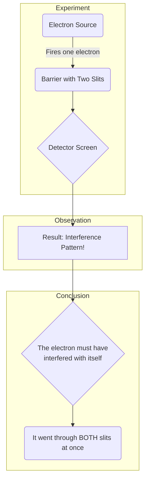

# Quantum Concept: The Double-Slit Experiment

**Objective:** Understand how a single particle can exhibit wave-like properties, defying classical intuition.

This is the foundational experiment of quantum mechanics, which Richard Feynman called "the heart of quantum mechanics."

## The Setup

Imagine a barrier with two narrow, parallel slits. On one side, we have a source that can fire single particles (e.g., electrons) one at a time. On the other side, we have a detector screen that records where each electron hits.

## The Classical Expectation

*   If we were firing marbles (classical particles), we would expect to see two distinct bands on the detector screen, corresponding to the two slits. Each marble goes through one slit or the other.

## The Quantum Reality

When we run this experiment with electrons, even firing them **one at a time**, we see something astonishing.

1.  Each electron arrives at the detector as a single, localized particle—a dot on the screen.
2.  However, after firing many electrons, the pattern of dots that emerges is not two simple bands. Instead, it's an **interference pattern**—a series of bright and dark fringes, just like what we'd see with a classical wave passing through both slits at once.

### The Implication: Wave-Particle Duality

The only way to explain this result is to conclude that the single electron:

*   **Travels as a wave**: It leaves the source as a "probability wave," goes through both slits simultaneously, and interferes with itself.
*   **Arrives as a particle**: When the wave interacts with the detector screen, it "collapses," and the electron appears at a single, random location consistent with the interference pattern.

This is **wave-particle duality**: the electron exhibits both wave-like and particle-like properties in the same experiment. It is neither a classical wave nor a classical particle; it is a quantum object.