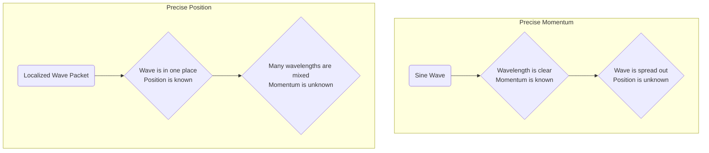

# Quantum Concept: The Uncertainty Principle

**Objective:** Understand the fundamental trade-off in precision between complementary properties like position and momentum.

Introduced by Werner Heisenberg, the Uncertainty Principle is not about limitations in our measurement equipment. It is a fundamental, built-in property of the universe that arises directly from wave-particle duality.

**The Principle:** It is impossible to simultaneously know both the position and the momentum of a quantum object with perfect accuracy. The more precisely you know one, the less precisely you know the other.

### A Consequence of Duality

This trade-off is inherent to the nature of waves.

*   **To have a definite momentum**, a particle's wave (its "wave function") must have a very regular, repeating, and clear wavelength. But such a wave is, by definition, spread out over all of space. Its **position is highly uncertain**.
*   **To have a definite position**, a particle's wave must be a sharp, localized spike (a "wave packet"). But to create such a spike, you have to add together many different waves with many different wavelengths. Its **momentum is highly uncertain**.

You are forced to choose. A perfectly localized particle has infinitely uncertain momentum. A wave with perfectly defined momentum is completely delocalized across the universe.

This isn't a matter of clumsy measurement; it's the price of knowledge baked into the fabric of reality.