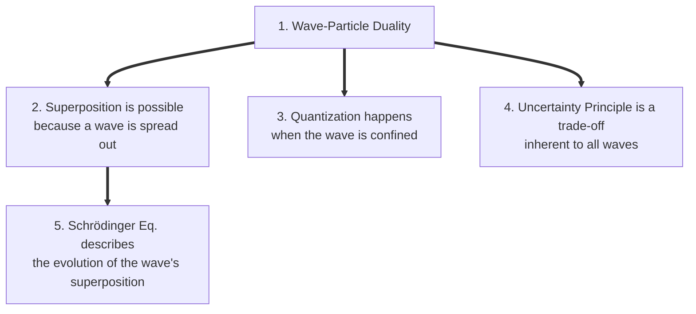

# 05: Synthesis and Articulation

**Objective:** Transform the "puzzle pieces" of individual concepts into a coherent, interconnected mental model. This step is non-negotiable for completing the learning plan.

Having studied the individual concepts, you must now explain the logical connections between them. A list of strange facts is not understanding. A causal chain of reasoning is.

## Core Task: Connect the Dots

Answer the following prompts, focusing on the *linkages*. Practice articulating your answers out loud.

1.  **How does Wave-Particle Duality *lead* to Superposition?**
    *   *Hint:* What does it mean for a single particle to pass through two slits at once? What is a wave? If the particle *is* the wave, can it be in a single place?

2.  **How is Quantization a *natural consequence* of a confined wave?**
    *   *Hint:* Use the guitar string analogy. Why can a string only play certain notes? What happens to the electron's wave when it's trapped inside an atom? Why can't it have an "in-between" energy level?

3.  **Why does the Uncertainty Principle *have* to exist if Wave-Particle Duality is true?**
    *   *Hint:* Describe the properties of a wave with a single, pure wavelength. Where is it located? Now describe the properties of a wave that is sharply localized in one spot. What does its wavelength look like? Can you have both at once?

4.  **Contrast the role of `F=ma` with the Schrödinger Equation.**
    *   *Hint:* What does each equation take as input? What does it output? Which one describes a world of certainty and which one describes a world of probability? How does the wave function `Ψ` fit into this?

### Final Articulation Exercise

Summarize the key differences between the classical and quantum worldview in your own words, touching on:

*   **State:** The nature of a system before measurement (hidden vs. indefinite).
*   **Energy:** The nature of allowed energy values (continuous vs. discrete).
*   **Measurement:** The role of the observer (revealing vs. creating reality).
*   **Evolution:** How the system changes over time (deterministic vs. probabilistic).

## The Final Picture

If you can successfully articulate these connections, you have constructed the target architecture: a coherent mental model where the bewildering quantum rules are shown to be logical consequences of a single, foundational rupture with classical physics: the discovery that particles are also waves.

