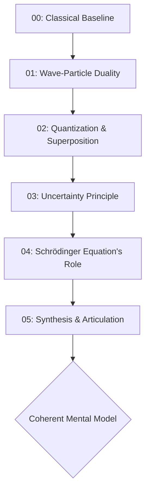

# Quantum Concepts Distilled

A structured knowledge repository to house learning materials for understanding the core principles of quantum physics. This project follows a specific, debate-tested pedagogical approach to ensure a coherent and intellectually honest mental model is built.

## 📚 Documentation

The official documentation, learning roadmap, and supporting references are published to Google Drive:

- **[Drive Folder: Quantum Concepts Distilled — R&D Lab](https://drive.google.com/drive/folders/1xJtki_uageHbxFIl1Nr3Iu2rl4tmMeCX)**
- **[Documentation Bundle](https://docs.google.com/document/d/177U6PDgxLE7c0A66GerXhRVxTxhwnFFd2aemWdZBhJY/edit?usp=drivesdk)**

## The Learning Philosophy

This is not a random collection of facts. The learning path is structured to build a connected understanding, based on two key principles:

1.  **Classical First**: Every quantum concept is introduced by first reviewing its classical counterpart. This contrast is essential to understanding *why* quantum mechanics is revolutionary.
2.  **Synthesis is Key**: The plan culminates in a dedicated step to connect all the concepts. A list of memorized facts is a failed outcome; an interconnected model is the only acceptable result.

## Learning Path

The repository is organized into a mandatory, sequential learning plan. Follow the directories in numerical order.

