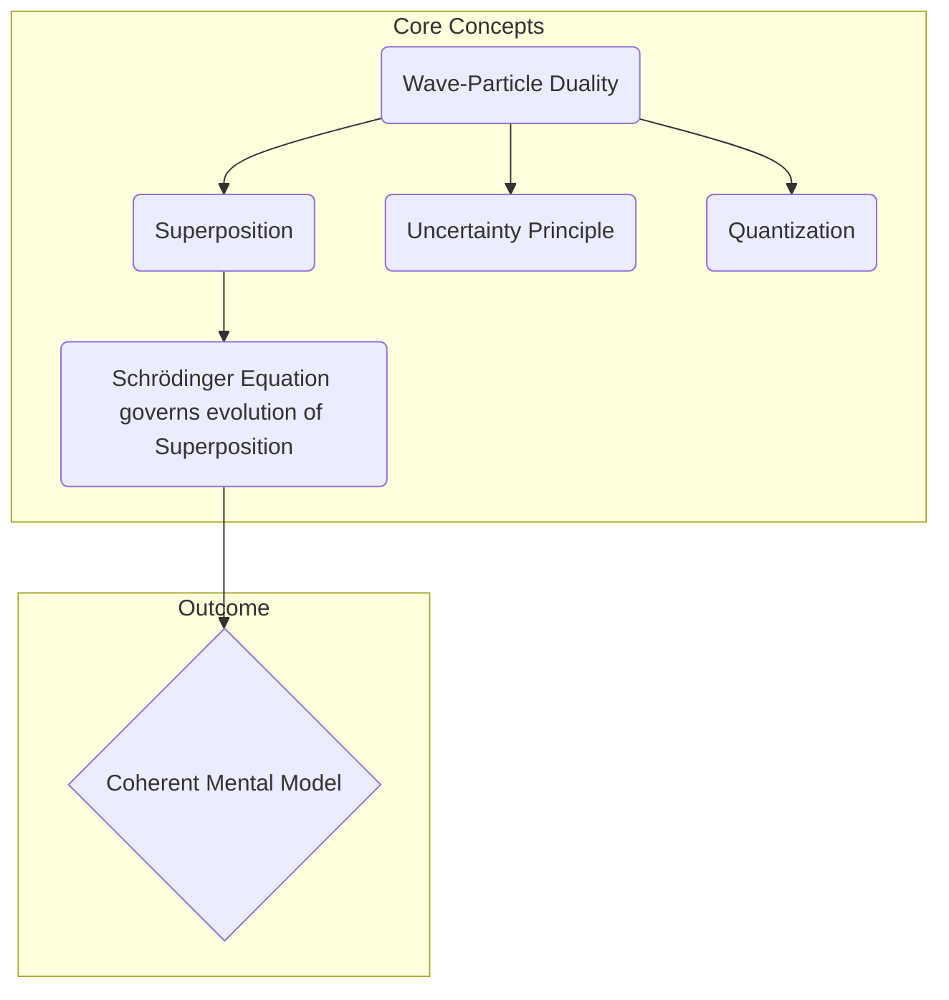

# Architecture: The Coherent Mental Model

The goal of this learning plan is to construct a **"Coherent Mental Model"** — an intellectual framework, not a software system. The "architecture" describes how the conceptual components of quantum mechanics interrelate.

The stability of this architecture is achieved only after the final Synthesis step is completed, where the learner explicitly connects the individual concepts.

## Conceptual Components

The primary components of the mental model are the core principles of quantum physics:

*   **Wave-Particle Duality**: The foundational concept that quantum objects have both wave and particle characteristics.
*   **Superposition**: A direct consequence of the wave nature, allowing a system to exist in multiple states at once.
*   **Quantization**: The principle that physical properties come in discrete amounts, another consequence of wave-like behavior in a confined system.
*   **Uncertainty Principle**: The fundamental limit on simultaneously knowing complementary properties, arising directly from duality.
*   **Schrödinger Equation**: The "engine" that describes how the wave function (and thus the superposition of states) evolves over time.

## Component Relationships

The architecture is hierarchical and causal. Wave-Particle Duality is the root from which the other core concepts logically flow.

### Key Architectural Constraints

1.  **Classical-First Mandate**: Every quantum module must be preceded by an explicit review of its classical counterpart.
2.  **Evidence-Driven**: Concepts must be tied to key experiments (e.g., Duality to the double-slit experiment).
3.  **No Premature Abstraction**: Conceptual understanding must precede deep mathematical formalism.
4.  **Synthesis is Non-Negotiable**: The final synthesis step is required to lock in the interconnected model.
